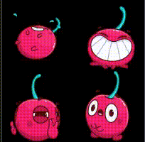

# AnotherLottie (rlottie-based QML module)

A Qt QML module for rendering Lottie animations powered by [rlottie](https://github.com/Samsung/rlottie) — a platform-independent library for rendering vector-based animations.

This module is designed as a drop-in replacement for Qt's built-in Lottie support, with broader feature coverage, dynamic resizing, and an API that stays intentionally close to the standard Qt component so migration is seamless.



---

## Why this module?

Qt's built-in `LottieAnimation` component is based on a limited subset of the Lottie spec. This module uses **rlottie** as the rendering backend, which covers significantly more Lottie features — meaning your animations are more likely to render correctly, especially complex ones exported from After Effects or Lottie-compatible tools.

Additionally, this module adds **dynamic image resizing** support, which is absent from the standard Qt implementation.

---

## Features

- 🎨 **Broader Lottie spec support** — powered by rlottie, handles more layer types, effects, and animation properties than Qt's native implementation
- 📐 **Dynamic resizing** — the rendered image scales responsively to the component's dimensions at runtime
- 🔁 **Playback control** — play, pause, stop, loop, and frame-level control
- 🔌 **Qt-compatible API** — property names and behavior mirror the standard `LottieAnimation` QML type, so switching requires minimal code changes

---

## Usage

```qml
import anotherlottie

AnotherLottie {
    id: animation
    width: 200
    height: 200
    source: "qrc:/animations/my_animation.json"
    autoPlay: true
    loops: AnotherLottie.Infinite
}
```

Playback control:

```qml
Button {
    text: "Pause"
    onClicked: animation.pause()
}

Button {
    text: "Play"
    onClicked: animation.play()
}
```

---

## Acknowledgements

- [rlottie](https://github.com/Samsung/rlottie) by Samsung — the rendering engine powering this module
- Qt Company — for the QML framework and the original `LottieAnimation` API design
